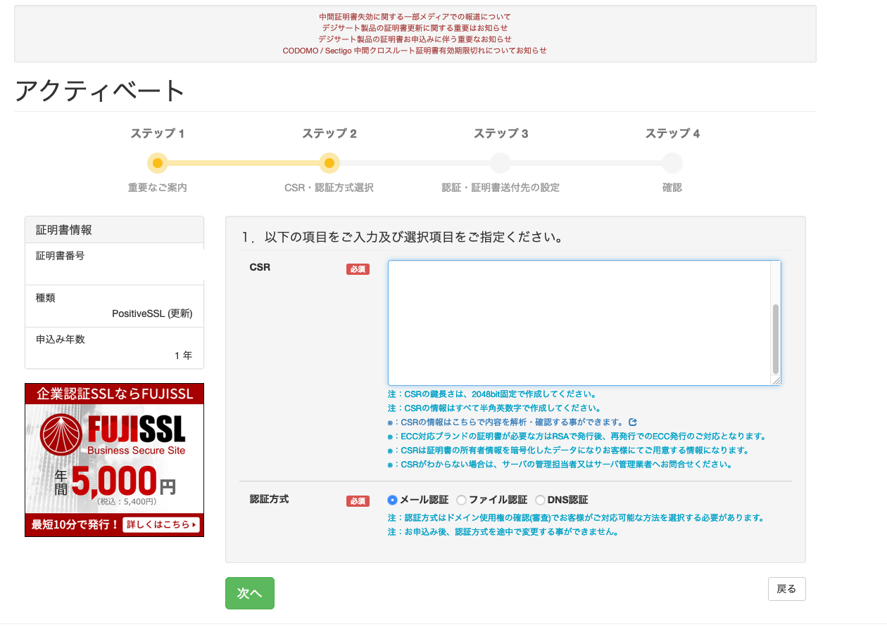
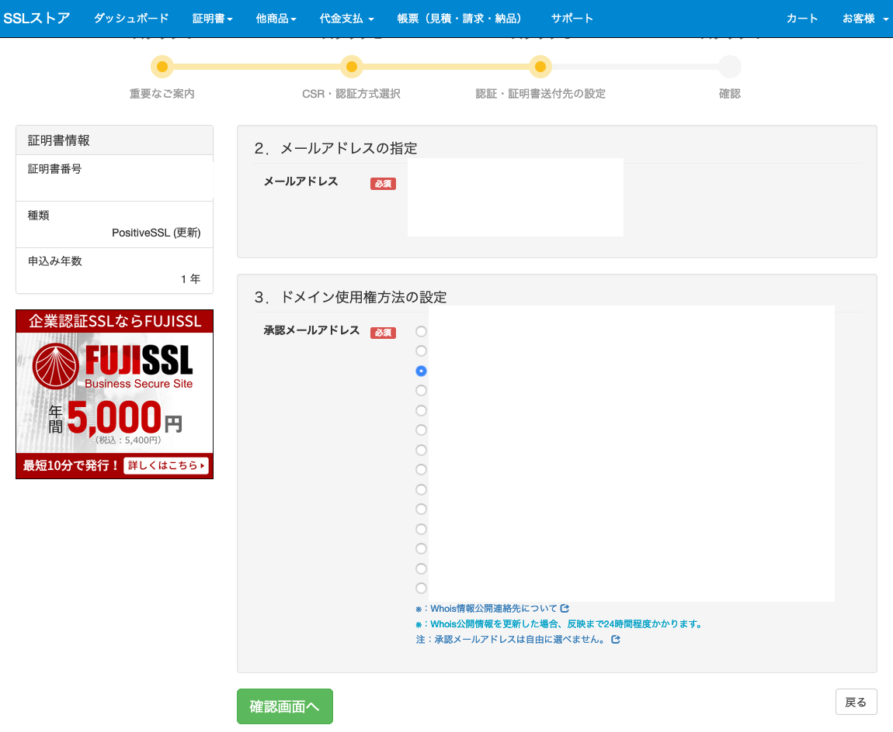

# ssl sotreで証明書を取得する手順

<https://www.ssl-store.jp/>

## 準備

### メール認証

メール印象に使えるアドレスは以下のいずれか。

* 管理者アドレス
* whoisに登録されているアドレス

管理者アドレスで受信できるか確認する。

* admin@<your_domain>
* administrator@<your_domain>
* hostmaster@<your_domain>
* postmaster@<your_domain>
* webmaster@<your_domain>

管理者アドレスが使えない場合、 whois情報の設定で連絡が取れるアドレスに変更する。

### dns認証

証明書発行時にcredential(dnsの設定情報)が送られてくるので、txtレコードに設定する。  

## csrの作成手順

[see](./openssl_csr.md)

## ssl storeで証明書の購入

* カートに証明書を入れる
* 入金
* 購入
* アクティベート
* コモンネームにfqdn(ex: example.com)を入れる
* メール認証にチェック
* csrのファイルの中身を貼って貼り付ける

* 技術者、担当者の情報を入力する

### メール認証の場合

* 証明書送信先でさっき登録した whois に登録されているメアドを選択

* whoisメアドに確認メールが飛んでくるので、問題がなければ承認URLをクリックする
* 30分くらいすると証明書が送られてくる

### dns認証の場合

* 受信できるアドレスを入力する。whoisメアドじゃなくても大丈夫。
* 認証に必要なcredential(dns設定情報)が送られてくるので、txtレコードに設定する。
* ssl storeのバッチがtxtレコードをチェックすると、証明書が送られてくる

### 証明書のメールに含まれるもの

* 中間証明書(複数)
* サーバ証明書

## apache, nginxの設定

[see](/doc/other/https.md)
