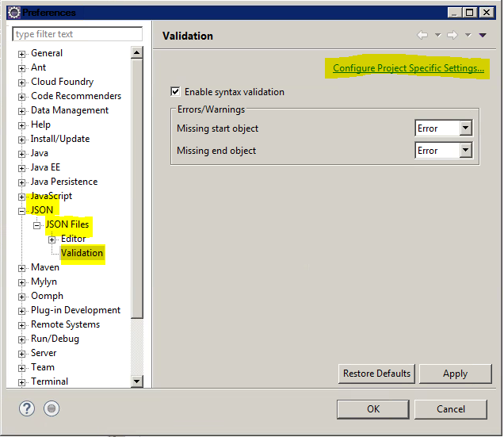

# eclipse jsonエラーを無視する

Preferences > JSON > JSON Files > Validation.

projectを右クリック > Validation をクリック

→jsonのエラーチェックをしなくなる   

### link

https://stackoverflow.com/questions/38917487/eclipse-neon-ignore-json-error