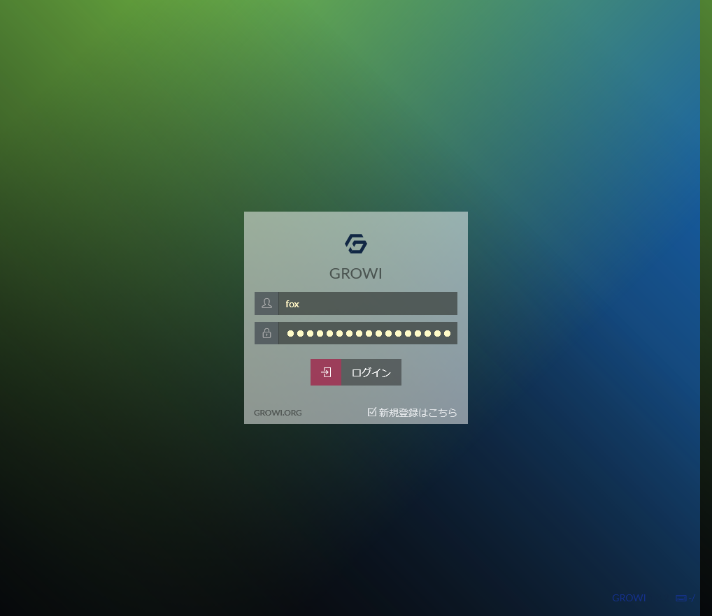

# growi - centos7でgrowi(crowi)をセットアップ


### install docker

see: https://docs.docker.com/engine/install/centos/

```bash
yum-config-manager \
    --add-repo \
    https://download.docker.com/linux/centos/docker-ce.repo

yum install docker-ce docker-ce-cli containerd.io

# ここに表示される最新のやつがインストールされる
yum list docker-ce --showduplicates | sort -r 
```

```bash
yum install docker-compose
```

起動
```bash
systemctl start docker # 起動
docker run hello-world # テスト
systemctl stop docker  # 停止
```


### install growi

```
cd /opt/
git clone https://github.com/weseek/growi-docker-compose.git growi
```

設定

```yml
# docker-compose.yml
       - MATHJAX=1             # 数式を使えるようにする
```

起動
```
cd /opt/growi
docker-compose up -d # 起動
docker-compose stop # 停止
```


http://localhost:3000/ にアクセスして繋がればおｋ




### セキュリティ

デフォルトだと誰でもアカウント作れちゃうので、アカウント作成OFFにする。    

http://localhost:3000/admin/security     
`Security setting > Configuration > Register limitation > Closed(Inviation only)`
にする。

 
