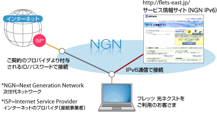
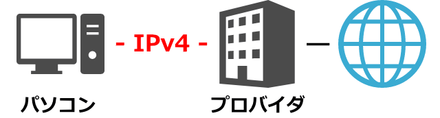
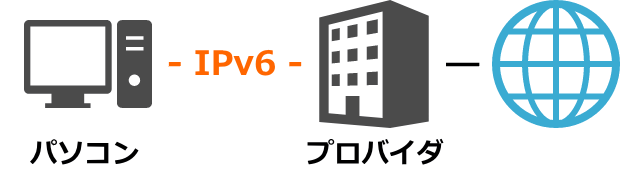
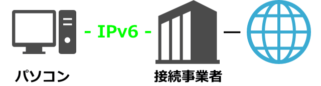
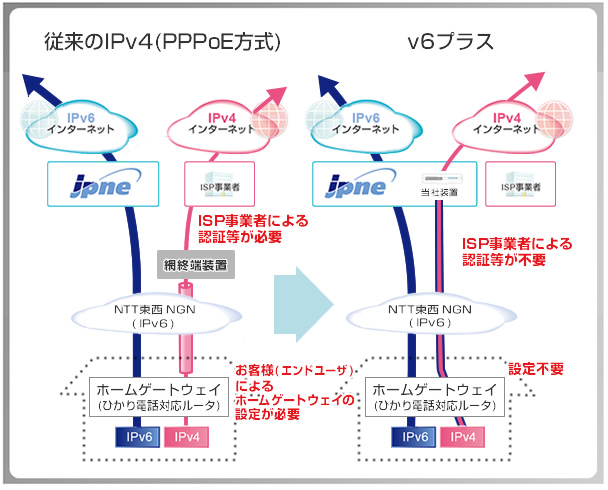

# IPv6接続方式

### インターネット認証プロトコル
* IPv4 PPPoe
* IPv6 PPPoe
* IPv6 IPoE
* IPv4 over IPv6

### NGN
NTT(とかKDDIとか)の電話やインターネットを統合した通信インフラのこと． 
電話とか専用回線とかインターネットとかを今まで個別に引いていたんだが，NGNでは同じインフラで使えるようにしている．  
SIP機能をつけることで電話や専用回線などはQoSで接続し，インターネットはベストエフォートで接続するみたいな制御を可能にしている． 

NGNはIPv6で構築された巨大イントラネットであり，インターネットではない． 
インターネットに接続する際には，NGNインフラからISPに接続し，ISP経由でインターネットに接続する． 
NGN内のIPv6アドレスと，インターネットのIPv6アドレスとがかぶってしまうというのが問題としてあるらしいが，なにかしらうまい方法で解決してるらしい． 

### IPv4 PPPoe
PPPをIPv4でカプセル化して，ISPを経由してインターネットに接続する． 
ISPは混雑するので時間帯によっては通信速度が遅くなる． 

### IPv6 PPPoe
PPPをIPv6でカプセル化して，ISPを経由してインターネットに接続する．
ISPは混雑するので時間帯によっては通信速度が遅くなる． 

### IPv6 IPoE
ISPではなくVNEを経由して，インターネットに接続する． 
IPv6で接続するので、IPv4は使えない．
IPv4サイトに接続する際には従来どおりIP4 PPPoeを使い接続するため，IPv4サイトは遅いままとなる．

### IPv4 over IPv6
通信方式はIPv6 only． 
IPv6 IPoE方式で接続する． 
IPv4のサイトには，IPv6プロトコルでカプセル化して送信される． 

カプセル化してくれるVNEとしては，jpneが有名らしい．  
ルータがIPv4 over IPv6に対応している必要がある．  
IPv4 over IPv6の規格として以下のものがある． 
* MAP-E
* DS-LITE

#### 商業的な話

PPPoE接続の場合は，NTTとISPが契約している． 

IPoEの場合は，NTTとISPは契約していない．
NTTとVNEが契約し，VNEとISPが契約しており，ISPはVNEにIPoEのサービスを代行してもらうという契約になっている．

#### 参考
* [IPv6 IPoEの仕組み:Geekなぺーじ](http://www.geekpage.jp/blog/?id=2013/1/11/1)
* https://volx.jp/v6plus-router
* https://www.jpne.co.jp/service/v6plus/
* https://volx.jp/map-e-ds-lite

### MAP-E対応ルータ
* https://help.gmobb.jp/app/answers/detail/a_id/018578
* https://www.marbacka.net/blog/iijmio_hikari_ipoe_ds-lite_router/
* http://休日有閑倶楽部.com/nec_ipoe
* http://www.rtpro.yamaha.co.jp/RT/docs/v6plus/
* http://www.iodata.jp/pio/io/network/ipv6.htm

### MAP-E 自作ルータで設定
* https://tsuchinoko.dmmlabs.com/?p=2694

### ND-proxy
* https://july-diary.hatenablog.com/entry/20140316/p1
* https://qiita.com/sumomoneko/items/fa56737f97beff3566f3

### 各プロバイダIPv6対応状況
* https://volx.jp/ipv6-provider
* http://www.aterm.jp/product/atermstation/topics/warpstar/ipv6.html

### IPv6申し込み
* [biglobe1](https://support.biglobe.ne.jp/ipv6/)
* [biglobe2](https://support.biglobe.ne.jp/ipv6/option.html)
