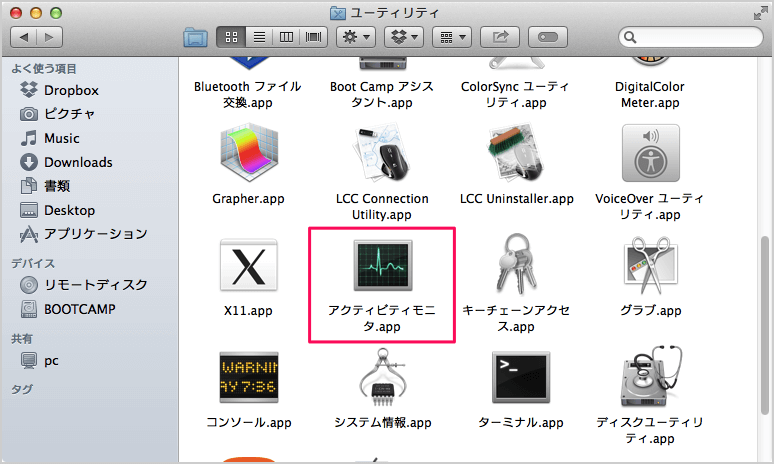

# mac ショートカットキー


* window最小化
    * Command + Option + M
    
* ターミナルが分割されちゃったのを戻す
    * Command + Shift + D
* ターミナル タブ移動    
    * Command + Shift + [←, →]
    
* 画面キャプチャ
	* Command + Shift + 4
	* 右下の方のサムネイルをクリック -> 完了
	* $HOME/書類 あたりにスクリーンショットが作成される
	
* sourcetTree reflesh
	* Command + R
* Eclipse コード補完 
    * Ctrl + Space

# 便利コマンド

CPU温度
```
$ istats
```


# 便利ソフトウェア

* mongodb compose
* medis	
* strongbox


#### Macでリソースを表示 - アクティブティモニタ

「Finder」→「アプリケーション」→「ユーティリティ」→「アクティビティモニタ」



    
    
